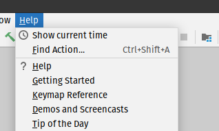
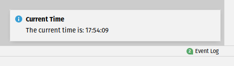

# Intellij Showtime Plugin

This is an Intellij plugin that simply shows the time. It can be triggered by pressing a button in the Help Menu. The current time is shown as a Notification at the bottom right corner of the project's window.

## Usage

1. Go to the Help Menu and press the `Show current time` option.

    

2. The current time will be displayed in a Notification in the bottom right corner. 

    

